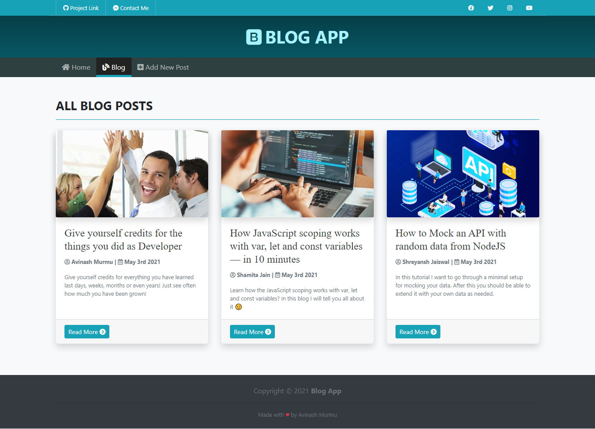

# Blog App

A simple blog app using NodeJS, Express & MongoDB.



\
\
||||||||||||||||||||

### **Features**

- All the CRUD functionalities
- `author`, `date`, `post thumbnail`, `summary`, `comments`
- **SummerNote** WYSIWYG Text Editor

\
\
||||||||||||||||||||

### **How To Run**

- clone this repository
- open **terminal** or **cmd**, `cd` on to this **blog-app/** directory and run command `npm i` to install all the dependencies
- Open `index.js` comment in `seedDB()` function call to seed the database
    ```js
    // seed the database
    seedDB();
    ```
- And then run `npm start` (to run with node) or `npm run dev` (to run with nodemon)
- Now comment out the `seedDB()` function call
    ```js
    // seed the database
    // seedDB();
    ```
- Open browser and hit **`localhost:3000`** to view the blog
